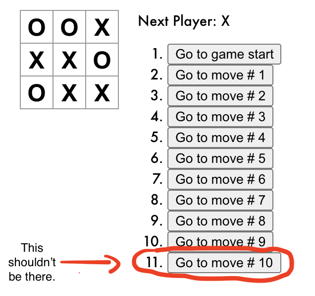

# Tic Tac Toe with Hooks

This is just me going through [React's intro tutorial](https://reactjs.org/tutorial/tutorial.html) but instead of 
using class based components, I'm adding functional based components with Hooks.

## *Update: 
You can play the game against computer, but the computer is pretty dumb. Even when you try to lose, you can still win.

## *Bugs
 - I'm getting a warning from React saying that my useEffect is missing a dependency. 
 - When it's a tie, when all the squares get filled, the computer still makes a move creating an extra step.
 
 
 
Let me know if you have a solution for this.

See [demo](https://yarocruz.github.io/tic-tac-toe-withHooks/)